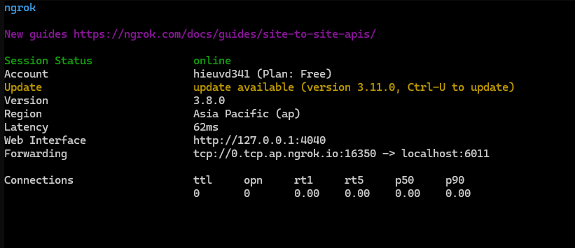

# vuln
### 1. Dựng vulnerability server
Bước 1: Khởi động Docker Desktop trên Windows
- Đảm bảo rằng Docker Desktop đã được cài đặt và đang chạy trên máy tính Windows của bạn.
Bước 2: Xây dựng và chạy ứng dụng
- Mở terminal tại thư mục chứa mã nguồn của ứng dụng dễ bị tấn công.
- Thực hiện các lệnh sau để xây dựng và chạy container Docker:
```bat
docker-compose build
docker-compose up
```
- Sau khi chạy, ứng dụng sẽ lắng nghe trên cổng 6011. Bạn có thể kết nối đến ứng dụng thông qua Linux command line hoặc Windows Subsystem for Linux (WSL) bằng lệnh:

```bash
nc localhost 6011
```

### 2. Sử dụng ngrok để triển khai ứng dụng ra mạng Internet
- Để cho phép truy cập từ xa tới ứng dụng của bạn, sử dụng ngrok để tạo một đường hầm TCP:
```bash
ngrok tcp 6011
```


- Khi ngrok chạy, bạn sẽ nhìn thấy giao diện terminal hiển thị thông tin về session như trong hình. Các thông tin quan trọng bao gồm:

    - Domain: `0.tcp.ap.ngrok.io`
    - Port: `16350`

Bạn có thể kết nối đến ứng dụng từ xa qua ngrok bằng lệnh:
```bash
nc 0.tcp.ap.ngrok.io 16350
```

### 3. Chạy chương trình exploit
- Thay domain và port ở phần 2 vào dòng remote bên trong `exploit.py`
```py
r = remote('0.tcp.ap.ngrok.io', 16350)
```

- Chạy script exploit để tấn công vào ứng dụng:
```bash
python3 exploit.py
```
ta sẽ lấy được shell của server.
